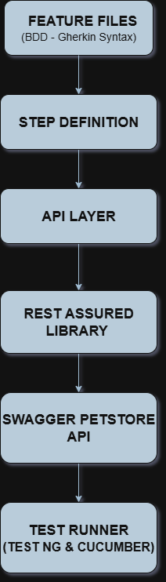

# 🚀 API Automation Framework

## 🛠️ Tech Stack

* Java
* REST Assured
* Cucumber (BDD)
* TestNG
* Maven
* Log4j2 (Logging)

---

## ▶️ How to Run

### Using IntelliJ:

1. Open project in IntelliJ
2. Load Maven dependencies
3. Run:
   `runners/TestRunner.java`

### Using Maven (Recommended):

```bash
mvn clean test
```

---

## 🧪 Test Cases

### ✅ Test Case 1: CRUD Operations

* Create, Get, Update, Delete pet

### ✅ Test Case 2: Inventory Validation

* Validate inventory and status APIs

### ✅ Test Case 3: Negative Testing

* Invalid inputs and error handling

### ✅ Test Case 4: Cross Endpoint Validation

* Validate data consistency across APIs

---

## 🔄 Framework Features

* BDD using Cucumber
* Modular architecture
* Reusable API methods
* Dynamic data handling
* Retry logic for API delays

---

## 📁 Project Structure

```
src
 ├── test
 │    ├── java
 │    │    ├── api
 │    │    ├── stepDefinitions
 │    │    ├── runners
 │    │    └── utils
 │    └── resources
 │         ├── features
 │         ├── config
 │         └── log4j2.xml
```

---

## 🏗️ Architecture Diagram



---

## ⚙️ Configuration

* Base URL is managed using:
  `config/config.properties`
* Avoids hardcoding and improves maintainability

---

## 📝 Logging

* Implemented using Log4j2
* Helps in debugging and tracking execution

---

## 📊 Reports

Execution reports are generated using Maven Surefire:

```
target/surefire-reports/index.html
```

---

## 👨‍💻 Author

Srikar G
